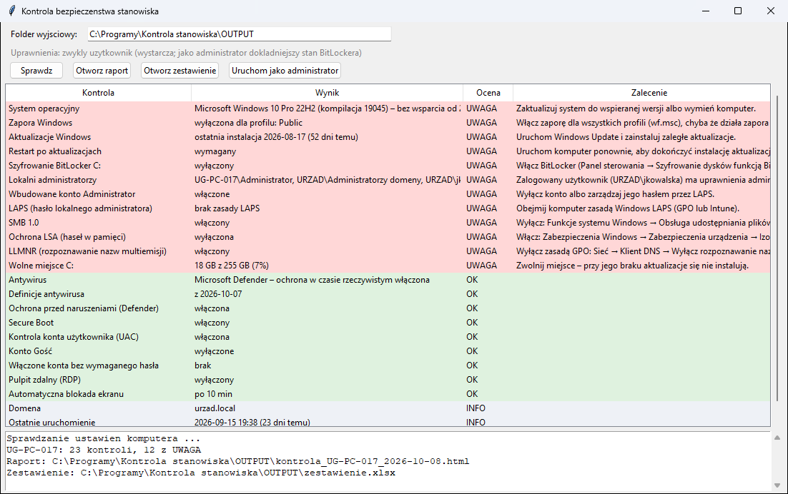
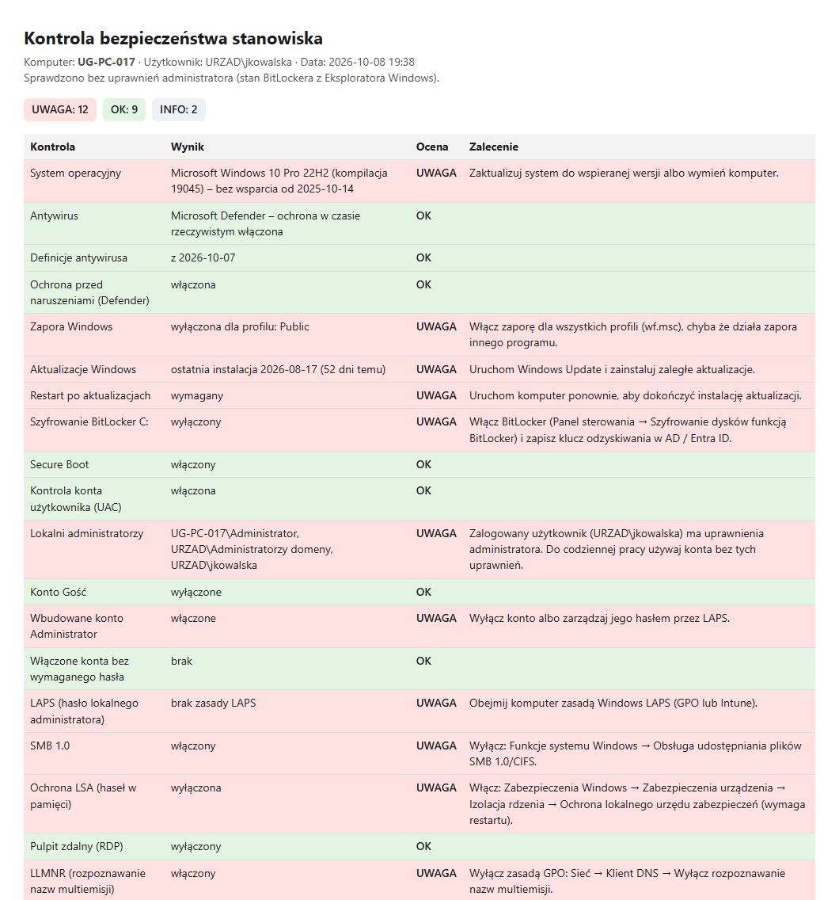

# Kontrola bezpieczeństwa stanowiska

Program dla administratora IT. W kilka sekund sprawdza **jeden komputer
z Windows** i daje listę kontrolną **OK / UWAGA**, a przy każdej UWADZE
zalecenie, co zrobić. Do dokumentacji (RODO, KRI, audyt wewnętrzny) tworzy:

- **raport HTML** do wydruku lub zapisu jako PDF, z miejscem na podpis,
- **zbiorcze zestawienie Excela**, w którym każdy sprawdzony komputer to
  jeden wiersz. Po obejściu biura z pendrive'em masz w nim stan wszystkich stanowisk.

Program **tylko odczytuje** ustawienia. Niczego nie zmienia, nie wyłącza
i nie instaluje. Działa **bez uprawnień administratora**.



*(na zrzutach dane fikcyjne)*

## Szybki start

1. Zainstaluj [Pythona](https://www.python.org/downloads/windows/) (zaznacz **„Add python.exe to PATH”**).
2. Pobierz `Kontrola-stanowiska-<wersja>.zip` z [najnowszego wydania](https://github.com/DawidBochno/Kontrola-stanowiska/releases/latest)
   (albo **Code → Download ZIP**) i rozpakuj, np. do `C:\Programy\`.
3. Uruchom **`install.bat`** (raz). Na końcu musi pojawić się „selftest OK”.
4. Uruchom **`uruchom.bat`** i kliknij **Sprawdz**.

## Co sprawdza

| Kontrola | UWAGA, gdy | Zalecenie programu (skrót) |
|----------|------------|----------------------------|
| System operacyjny | system bez wsparcia Microsoft albo koniec wsparcia w ciągu 180 dni (Windows 10: 14.10.2025) | aktualizacja / wymiana |
| Antywirus | brak ochrony w czasie rzeczywistym. Rozpoznaje Defendera i antywirusy innych firm (Centrum zabezpieczeń Windows). | włączyć |
| Definicje antywirusa | starsze niż 3 dni | zaktualizować |
| Ochrona przed naruszeniami (Defender) | wyłączona; złośliwe oprogramowanie może wtedy wyłączyć Defendera | włączyć |
| Zapora Windows | wyłączona dla któregoś profilu (domena / prywatny / publiczny) | włączyć (wf.msc) |
| Aktualizacje Windows | ostatnia instalacja ponad 35 dni temu | Windows Update |
| Restart po aktualizacjach | oczekuje | uruchomić ponownie |
| Szyfrowanie BitLocker (każdy dysk) | wyłączone, wstrzymane albo „czeka na aktywację” | włączyć, zapisać klucz w AD / Entra ID |
| Secure Boot | wyłączony / tryb BIOS | włączyć w UEFI |
| Kontrola konta użytkownika (UAC) | wyłączona albo bez pytania administratora | domyślny poziom |
| Lokalni administratorzy | **zalogowany użytkownik jest administratorem** | praca na koncie bez uprawnień |
| Konto Gość | włączone | wyłączyć |
| Wbudowane konto Administrator | włączone bez LAPS | wyłączyć albo LAPS |
| Włączone konta bez wymaganego hasła | są | ustawić hasło / wyłączyć |
| LAPS (komputery w domenie) | brak zasady Windows LAPS ani starego LAPS | objąć zasadą |
| SMB 1.0 | włączony (protokół wykorzystany przez WannaCry) | wyłączyć |
| Windows PowerShell 2.0 | włączony (omija zabezpieczenia nowszych wersji) | wyłączyć |
| Ochrona LSA | wyłączona (łatwiejsza kradzież haseł z pamięci) | włączyć w Izolacji rdzenia |
| Pulpit zdalny (RDP) | włączony **bez NLA** (z NLA to tylko informacja) | włączyć NLA / wyłączyć RDP |
| LLMNR | nie wyłączony zasadą (przechwytywanie haseł w sieci lokalnej) | GPO: Klient DNS |
| Automatyczna blokada ekranu | brak albo dłużej niż 15 min | GPO limit bezczynności / wygaszacz z hasłem |
| Wolne miejsce (każdy dysk) | mniej niż 10% | zwolnić miejsce |
| Domena, ostatnie uruchomienie | — (informacja) | |

Na ekranie i w raporcie wiersze z UWAGĄ są na górze, na czerwono.
**Dwuklik** na wierszu pokazuje pełne zalecenie.

## Raport i zestawienie



- **`OUTPUT\kontrola_<KOMPUTER>_<data>.html`** otwiera przycisk **Otworz raport**.
  Wydruk lub „Zapisz jako PDF” z przeglądarki daje dokument z podsumowaniem
  i polem na podpis sprawdzającego.
- **`OUTPUT\zestawienie.xlsx`**: wiersz na komputer, kolumna na kontrolę,
  komórki na czerwono (UWAGA) lub zielono (OK) i liczba UWAG. Ponowna
  kontrola tego samego komputera **zastępuje** jego wiersz.

### Sprawdzanie wielu komputerów

**Z pendrive'a:** skopiuj folder programu na pendrive (Python musi być na
każdym komputerze), uruchom na każdym stanowisku i kliknij **Sprawdz**.
Wszystkie wyniki trafią do jednego `zestawienie.xlsx` na pendrivie.

**Bez okna** (np. zadanie harmonogramu albo skrypt logowania):

```bat
pyw -3 kontrola.py --bez-okna \\serwer\IT\kontrole
```

Wynik trafia do wskazanego folderu. Jeśli w tej samej chwili zestawienie
zapisuje inny komputer albo plik jest otwarty w Excelu, wiersz nie zostanie
dopisany. Raport HTML zapisze się mimo to, a w logu będzie komunikat.
Przy kilkudziesięciu komputerach logujących się o 8:00 lepiej uruchamiać
kontrolę w różnych godzinach albo zbierać tylko raporty HTML.

## Uprawnienia administratora

Nie są potrzebne. Bez nich stan BitLockera jest odczytywany tak jak
w Eksploratorze Windows (ikona kłódki na dysku). Przycisk **Uruchom jako
administrator** uruchamia program ponownie z uprawnieniami. Wtedy BitLocker
jest sprawdzany dokładnie (`Get-BitLockerVolume`), łącznie z ochroną
wstrzymaną na zaszyfrowanym dysku.

**Blokada ekranu** jest sprawdzana dla użytkownika, który uruchomił
program. Przy „Uruchom jako administrator” na innym koncie wynik dotyczy
tamtego konta.

## Instalacja (jednorazowo)

1. **Python**: pobierz z [python.org](https://www.python.org/downloads/windows/)
   (wersja 3.9 lub nowsza). W instalatorze zaznacz **„Add python.exe to PATH”**.
   Opcja „tcl/tk and IDLE” jest zaznaczona domyślnie i musi taka zostać.
2. **Program**: z [najnowszego wydania](https://github.com/DawidBochno/Kontrola-stanowiska/releases/latest)
   pobierz ZIP i rozpakuj. Nie uruchamiaj programu z wnętrza ZIP-a.
3. Kliknij dwukrotnie **`install.bat`**. Instaluje bibliotekę `openpyxl`
   (potrzebny internet) i uruchamia test, który sprawdza też odczyt
   ustawień tego komputera. Na końcu pojawia się **„selftest OK”**.
4. Program uruchamia się plikiem **`uruchom.bat`**.

Wymagania: Windows 10/11 lub Windows Server 2016+ (PowerShell 5.1 jest
w systemie), Python 3.9+.

## Czy program zostanie zablokowany przez antywirusa?

Zwykle nie. Uruchamia PowerShell z poleceniami **tylko do odczytu**
(`Get-MpComputerStatus`, `Get-NetFirewallProfile`, `Get-LocalUser`,
rejestr). Skrypt jest przekazywany jako `-EncodedCommand`, co niektóre
systemy EDR oznaczają jako podejrzane. Jeśli taki alert się pojawi, kod
skryptu jest jawny w `kontrola.py` (`SKRYPT_PS`) i można go pokazać
zespołowi bezpieczeństwa. Przy zasadach AppLocker/WDAC może być
zablokowany sam Python.

## Prywatność

Raport zawiera nazwę komputera, nazwy kont i słabe punkty konfiguracji.
Traktuj go jak dokument wewnętrzny. Folder `OUTPUT` nie trafia do
repozytorium. Program nie wysyła danych poza Twój komputer.

## Aktualizacje

Po uruchomieniu program sprawdza w tle na GitHubie, czy jest nowa wersja.
Jeśli jest, pyta **„Pobrać i zainstalować teraz?”**. `OUTPUT` nie jest
nadpisywany. Do GitHuba trafia tylko zapytanie o listę plików.
**Wyłączenie:** pusty plik `NIE_AKTUALIZUJ` w folderze programu.

## Ograniczenia

- Sprawdza **komputer, na którym jest uruchomiony**. Zdalne sprawdzanie
  wielu komputerów z jednego miejsca (WinRM) jest na liście pomysłów.
- Daty końca wsparcia pochodzą z tabeli w programie. Windows 10 z płatnymi
  aktualizacjami ESU jest oznaczany jako „bez wsparcia”, bo ESU nie widać
  w systemie w prosty sposób.
- Blokada ekranu: brane są pod uwagę zasada „limit braku aktywności”
  i wygaszacz z hasłem. Uśpienie z hasłem po wybudzeniu nie jest sprawdzane.
- Zapora innego producenta (wyłączona zapora Windows) daje UWAGĘ. Wtedy sprawdź ją ręcznie.
- To szybka kontrola podstaw, a nie pełny audyt zgodności (np. CIS Benchmark).

## Testy

```bash
python kontrola.py --selftest
```

Test sprawdza ocenę na dwóch fikcyjnych komputerach: wzorowym (same OK)
i zaniedbanym (20 UWAG). Do tego antywirus innej firmy, BitLocker
wstrzymany, tabelę końca wsparcia, raport HTML i zestawienie (zastąpienie
wiersza, nowe kolumny). Na końcu **odczytuje prawdziwe ustawienia
komputera**, na którym działa. Na GitHubie jest to czysty Windows Server,
więc każda zmiana skryptu PowerShell jest sprawdzana na prawdziwym systemie.
